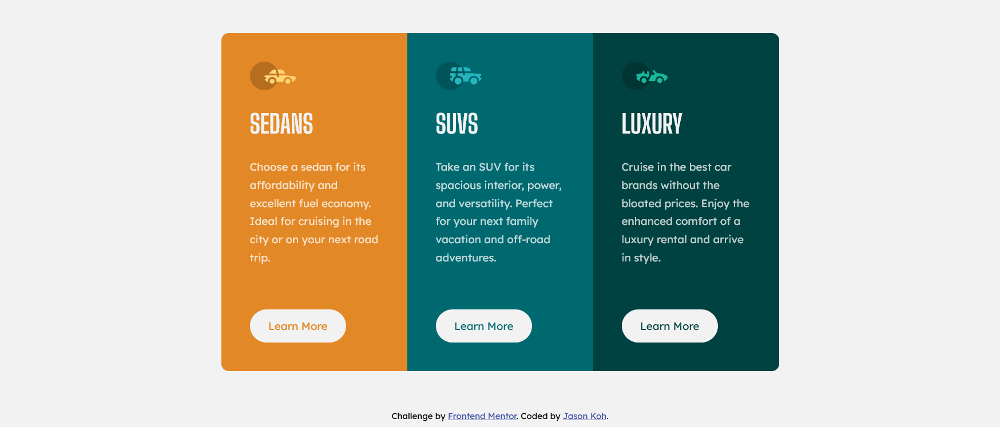

# Frontend Mentor - 3-column preview card component

## Welcome! 👋

This is a solution to the [3-column preview card component challenge on Frontend Mentor](https://www.frontendmentor.io/challenges/3column-preview-card-component-pH92eAR2-). Frontend Mentor challenges help you improve your coding skills by building realistic projects. 

## The challenge

Build out this 3-column preview card component and get it looking as close to the design as possible.

Users should be able to:

- View the optimal layout depending on their device's screen size
- See hover states for interactive elements

## Overview

### The challenge

Users should be able to:

- View the optimal layout depending on their device's screen size
- See hover states for interactive elements

### Screenshot

### Links

- Solution URL: [Github](https://github.com/jasonkwm/3-column-preview-card-component-main)
- Live Site URL: [Live on Vercel](https://3-column-preview-card-component-main-sand.vercel.app/)

## My process

### Built with

- Semantic HTML5 markup
- Mobile-first workflow
- Flexbox
- Sass | Compiled with *Live Sass Compiler* on VS Code 

